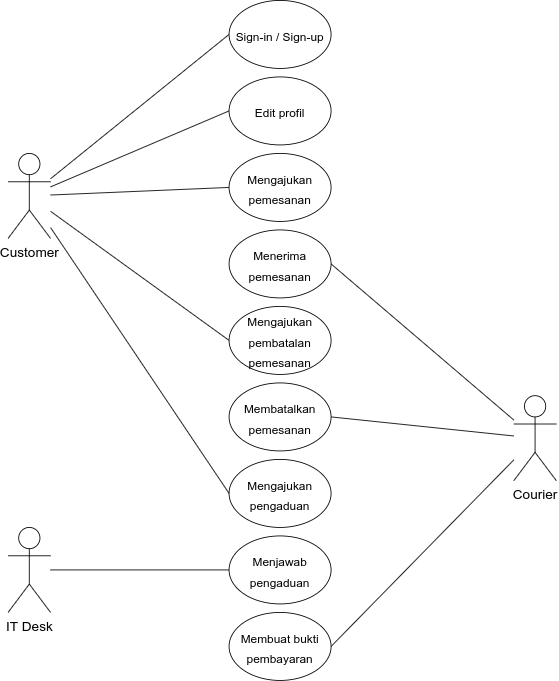
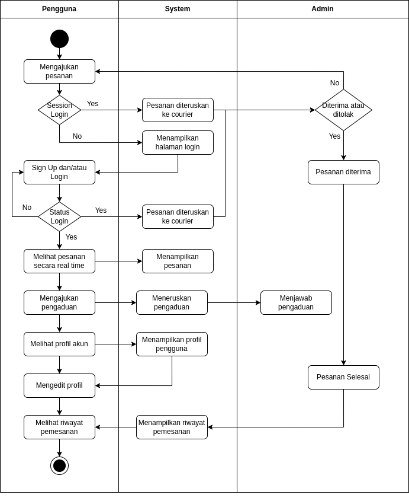
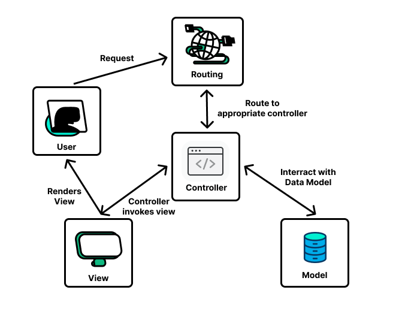

    
    <h1>Agrilogs</h1>

## Kelompok 4 P2
- Zahra Fitriani - G6401201038
- Nauval Helmy Calya - G6401201057
- Patar Isac Pardomuan - G6401201092
- Muhammad Ariq Aziz - G6401201093

## Deskripsi
Agrilogs merupakan sebuah platform pengiriman hasil panen berbasis website. Dengan platform ini, user dapat memesan kurir untuk mengirimkan produk pertanian kepada tempat yang ingin dituju. Pembayaran dilakukan setelah user memesan kurir secara tunai.

## Latar Belakang
Latar belakang didirikannya Agrilogs karena adanya keinginan untuk memudahkan petani dalam mengantarkan produknya agar tetap dalam keadaan fresh. Karena masih jarang sekali, jasa pengantaran khusus produk pertanian yang dapat mengantarkan produk dalam jumlah besar dan menjamin kualitas yang baik hingga sampai ke konsumen. Kami juga ingin memotong proses panjang dari produk-produk pertanian ke tangan konsumen sehingga para petani dapat mendapatkan keuntungan utuh.

## Solusi yang Dikembangkan
Solusi yang coba kami kembangkan ialah membangun sebuah website pengantaran produk pertanian. Disini costumer dapat menggunakan jasa pengantaran pertanian yang telah disediakan, driver yang akan mengantarkan produk costumer adalah driver terpilih yang sudah memiliki kelengkapan khusus untuk mengantarkan produk pertanian, sehingga sesuai misi kami, konsumen akan mendapatkan produk pertanian yang fresh dengan kualitas terbaik.

## Tech Stack yang Digunakan
<b>Website</b>
- Frontend
    - Bootstrap
- Backend
    - Laravel 9
- DBMS
    - MongoDB

<b>Mobile</b>
- Framework
    - React Native
- DBMS
    - MongoDB

## Hasil dan Pembahasan
### Use Case Diagram

### Activity Diagram

### Class Diagram

### Arsitektur Sistem

## Lampiran
<ul>
    <li><a href="https://trello.com/b/PMG7nY7v/agrilogs-development">Trello</a></li>
    <li><a href="">Google Drive Mobile App</a></li>
    <li><a href="">Slide</a></li>
</ul>

## Saran untuk Pengembangan Selanjutnya
